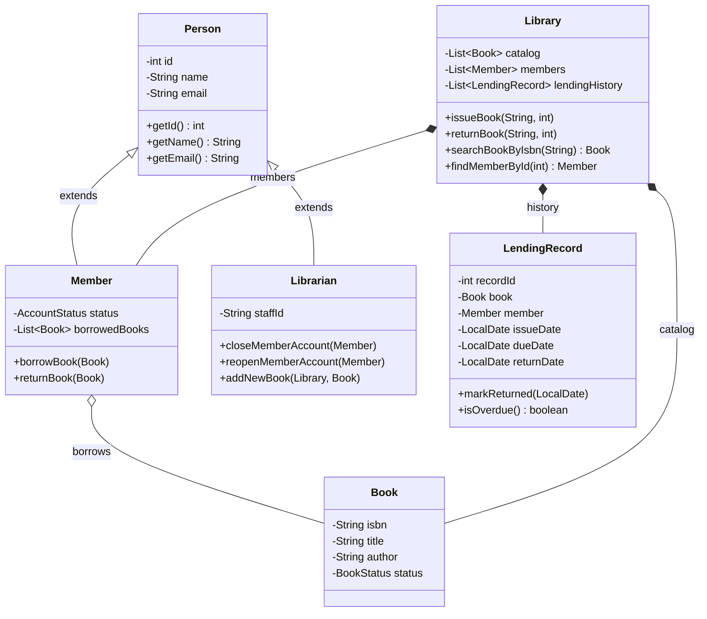

# Library Management System

A console-based Library Management application built from scratch in Java to practice and showcase core Object-Oriented Programming (OOP) principles.

I built this project to go beyond simple toy classes and model how a real-world library operates: patrons borrow and return books, librarians hold administrative privileges to manage inventory and member standing, and the library enforces business rules on every transaction with a timestamped audit trail.

---

## What Does This Project Do?

The program runs an interactive, menu-driven loop in your terminal where you can:
- **Browse & Search:** View the entire book catalog or find a specific book by its ISBN.
- **Borrow Books:** Patrons can borrow available books (automatically sets book status to `BORROWED` and adds it to the member's list).
- **Return Books:** Patrons return books they hold (resets status to `AVAILABLE` and removes it from their list).
- **Member Profiles:** View a member's contact info, account standing (`ACTIVE` vs `CLOSED`), and their list of currently checked-out books.
- **Staff Controls:** Librarians have administrative authority to close or reopen member accounts, and catalog new books.
- **Audit Logging:** Every checkout generates a `LendingRecord` with a 14-day due date, records the actual return date upon return, and flags overdue loans.

---

## OOP Concepts & Architecture (How It Works)

Here is a breakdown of the specific concepts implemented across the project and why each design choice was made:

### 1. Type Safety with Enums (`AccountStatus`, `BookStatus`)
Instead of using plain strings like `"available"` or `"borrowed"` (which easily cause silent bugs due to typos like `"availible"`), I created two enums:
- `BookStatus`: `AVAILABLE`, `BORROWED`
- `AccountStatus`: `ACTIVE`, `CLOSED`

This forces the compiler to catch invalid states at compile time rather than failing at runtime.

### 2. Inheritance & Code Reuse (`Person`, `Member`, `Librarian`)
Both library patrons and staff members share basic human identity fields: an ID, a name, and an email.
- Created `Person.java` as the shared base class to hold those three fields and their getters/setters.
- `Member.java` extends `Person`, adding patron-specific state: their `AccountStatus` and their `List<Book> borrowedBooks`.
- `Librarian.java` extends `Person`, adding a `staffId` and administrative methods to suspend/reactivate member accounts and add inventory.
- Both subclasses use constructor chaining with `super(id, name, email)` to delegate identity setup to the parent class.

### 3. Encapsulation & Data Hiding
All entity fields across `Book`, `Person`, `Member`, `Librarian`, and `LendingRecord` are marked `private`. External classes cannot directly mutate properties; they must go through public methods and getters/setters.

### 4. Defensive Initialization (Null-Safety)
In `Member.java`, `borrowedBooks` is explicitly initialized as `new ArrayList<>()` inside the constructor. This ensures that the collection is never `null`, eliminating potential `NullPointerException` crashes when adding the first borrowed book.

### 5. Business Logic & Guard Clauses in `Library.java`
Rather than letting a member blindly grab a book, the `Library` class acts as the gatekeeper. When `issueBook(isbn, memberId)` is called, it checks 4 guard clauses before allowing the loan:
1. Does the book exist in the catalog?
2. Is the member registered?
3. Is the member's account `ACTIVE`? (Closed accounts cannot borrow).
4. Is the book currently `AVAILABLE`? (Cannot borrow an already checked-out book).

If any check fails, the method exits early with a clear explanation. Only when all checks pass does it execute the transfer and create the audit record.

### 6. Modern Date Handling & Transactions (`LendingRecord`)
To track borrowing timelines, `LendingRecord.java` uses Java's modern `java.time.LocalDate` API:
- Automatically calculates a 2-week due date: `issueDate.plusDays(14)`.
- Leaves `returnDate` as `null` while the loan is active.
- Stamps `LocalDate.now()` upon return.
- Provides an `isOverdue()` helper comparing current date against `dueDate`.

---

## Class Diagram



---

## Project Structure

```text
├── README.md               # You are here!
├── Steps.txt               # Plain-text step-by-step handbook & notes
└── src/
    ├── AccountStatus.java  # Enum for member account state (ACTIVE, CLOSED)
    ├── BookStatus.java     # Enum for inventory state (AVAILABLE, BORROWED)
    ├── Person.java         # Base class for human identity
    ├── Member.java         # Patron subclass holding borrowed books
    ├── Librarian.java      # Staff subclass with administrative actions
    ├── Book.java           # Book domain entity with ISBN and status
    ├── LendingRecord.java  # Transaction log slip with issue/due/return dates
    ├── Library.java        # Central coordinator & transaction guard manager
    └── App.java            # Main entry point with interactive switch-case menu
```

---

## How to Run

### Option 1: Using VS Code
1. Open the project folder in VS Code.
2. Open `src/App.java`.
3. Click the **Run** button at the top right of the editor (or press `F5`).

### Option 2: Using the Command Line
From the project root:

```bash
# Compile all source files into a bin folder
javac -d bin src/*.java

# Run the App class
java -cp bin App
```

---

## Sample Console Session

When launched, `App.java` pre-loads 3 books (*Effective Java*, *Head First Java*, *Clean Code*) and 2 members (*Alice* #101, *Bob* #102) so you can test right away:

```text
==================================================
   WELCOME TO THE LIBRARY MANAGEMENT SYSTEM       
==================================================
----------------- MAIN MENU -----------------
1. View All Books in Catalog
2. Search Book by ISBN
3. Borrow / Issue a Book
4. Return a Book
5. View Member Details & Borrowed Books
6. Register a New Member
7. Add a New Book to Catalog
8. View Lending History (Audit Log)
9. Exit
---------------------------------------------
Enter your choice (1-9): 3

Enter Book ISBN to issue: 978-0134685991
Enter Member ID: 101

Effective Java has been borrowed by Alice Smith.
Success: 'Effective Java' issued to Alice Smith (Record ID: 1, Due Date: 2026-09-28).
```

If you try to issue that same book to Bob right after:
```text
Enter your choice (1-9): 3

Enter Book ISBN to issue: 978-0134685991
Enter Member ID: 102

Cannot issue book: 'Effective Java' is already borrowed.
```

---

## Key Takeaways & Lessons Learned

A few practical Java insights gained while writing this project:
1. **String Comparison:** Always use `.equals()` instead of `==` when comparing ISBNs or text, because `==` checks reference identity rather than string content.
2. **Scanner Newline Quirks:** In console apps, using `scanner.nextInt()` followed by `scanner.nextLine()` often reads empty trailing newlines. Parsing strings with `Integer.parseInt(scanner.nextLine().trim())` inside a `try-catch` prevents both newline issues and crashes from non-numeric input.
3. **Guard Clauses vs Nested Ifs:** Using early `return;` statements when input is invalid keeps business methods flat, readable, and easy to follow.

---

## What Could Be Added Next?
If I continue expanding this project in the future, the next logical steps would be:
- Adding persistence (saving catalog and member data to a local CSV/JSON file or SQLite database so state persists between runs).
- Replacing console print statements in business logic with custom exceptions (`BookNotAvailableException`, `MemberNotFoundException`).
- Writing automated JUnit 5 tests for the `Library` issue/return guard clauses.
